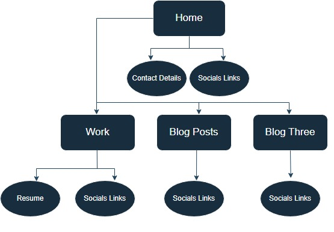
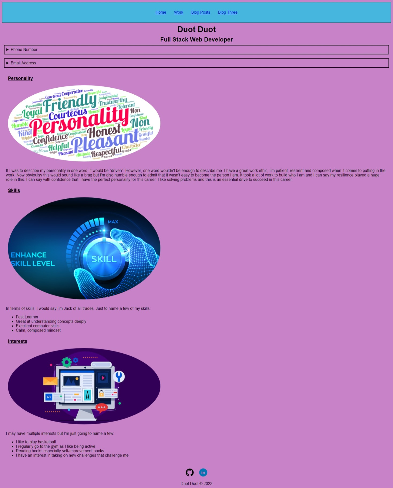
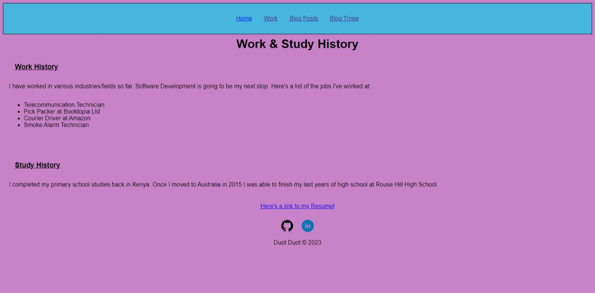
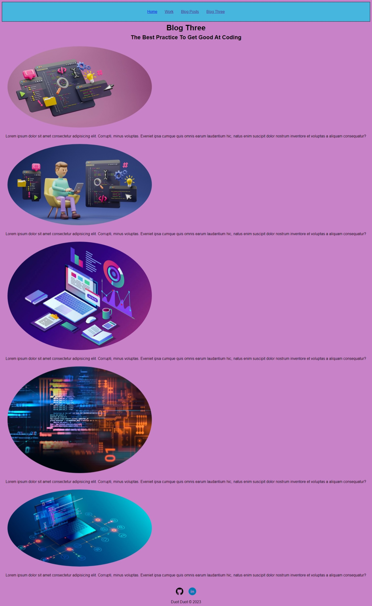

# Portfolio Website 

[Link to portfolio website](https://portfolio-website-theta-two-82.vercel.app/)  
[Link to Github Repository](https://github.com/Duotduot/portfolio-website)

## Description Of My Portfolio Website
### Purpose
The portfolio website serves as a starting point for my software development journey.
This website is a basic site about me and what I could offer to potential employers.

### Functionality / features
I have implemented a few feautures since it is a static website. The website itself is
functional enough to browse through. A few features include; *navigation bar*, *social buttons*, *hyperlinks* etc.

### Sitemap

### Screenshots

### Target Audience
Employer looking to engage a dev and/or IT professional.

### Tech Stack
* Html
* Css
* Vercel